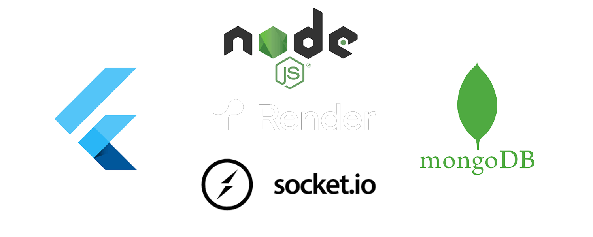
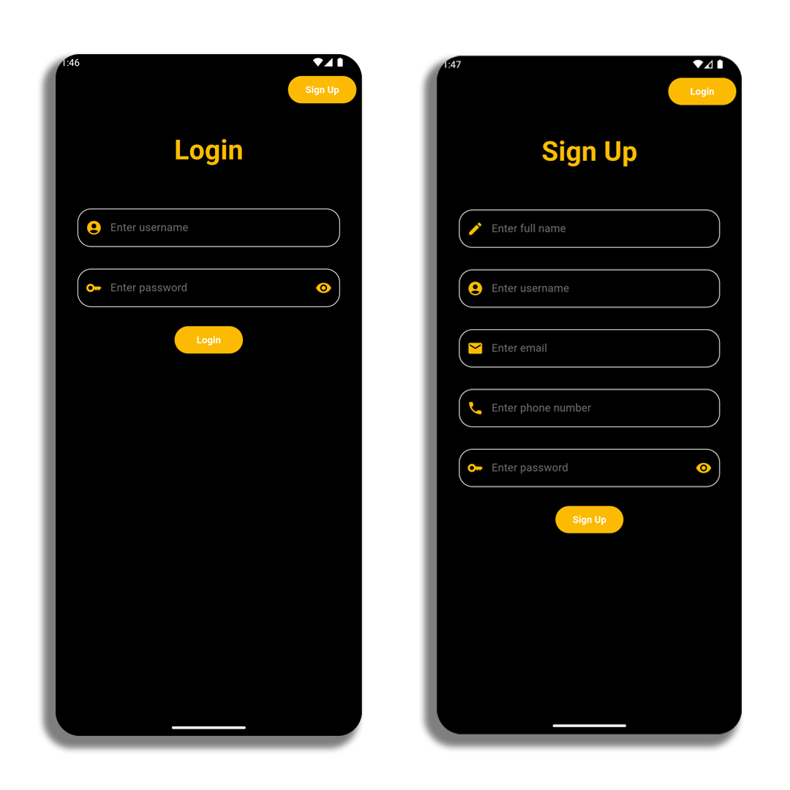
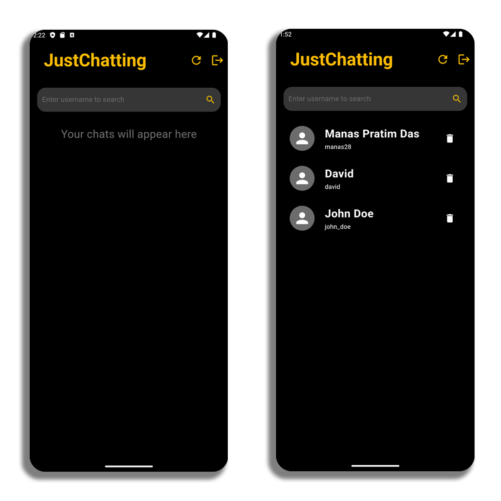
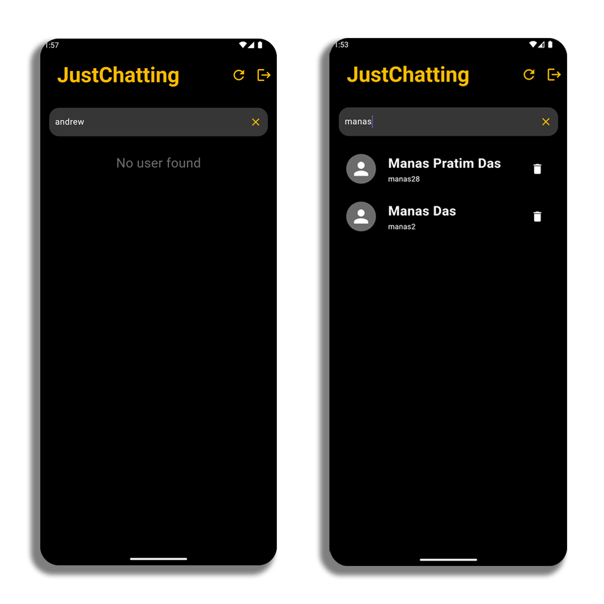
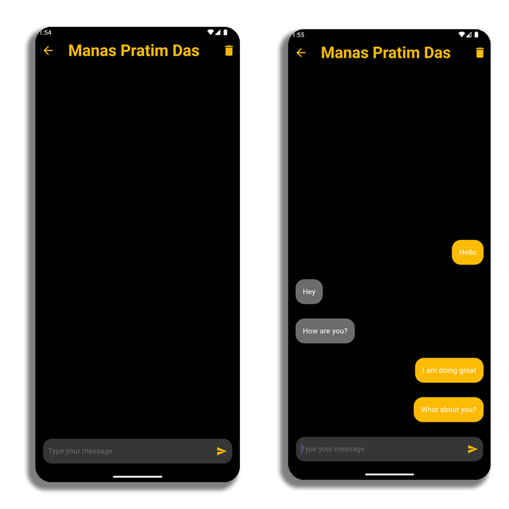

# JustChatting

JustChatting is a Flutter-based chat application that allows users to communicate with each other through real-time messaging. This README provides an overview of the main pages in the app, including the Authentication Page, Home Page, Search Page, and Individual Chat Page.

## Technology Stack

- **Frontend**: Flutter
- **Backend**: Node.js
- **Database**: MongoDB
- **API Hosting**: Render.com
- **Real-time Synchronization**: Socket.io



## Frontend

### Authentication Page

The Authentication Page is the entry point of the JustChatting app. It consists of two main sections: the Login Page and the Sign Up Page. These pages allow users to sign in to their existing accounts or register for a new account, respectively.

#### Login Page

The Login Page allows users to sign in to their existing accounts using their username and password.

- **Username and Password Input:** Users can enter their username and password.
- **Login Button:** Authenticates the user with the provided email and password. If the authentication is successful, the user is redirected to the Home Page. If authentication fails, an error message is displayed, indicating the issue (e.g., incorrect email or password).
- **Error Handling:** Displays error messages for invalid inputs or failed authentication attempts.

#### Signup Page

The Signup Page allows new users to create an account by providing their email and password.

- **User Detail Inputs:** Users can enter their details and choose a password to create a new account.
- **Sign Up Button:** Submits the provided information to create a new user account. If the account creation is successful, the user is redirected to the Login Page. If there is an issue (e.g., email already in use), an error message is displayed.
- **Error Handling:** Displays error messages for invalid inputs or failed signup attempts.

By providing clear pathways for both logging in and signing up, the Authentication Page ensures a smooth user experience for both new and returning users.



### Home Page

The Home Page serves as the main hub for the user after logging in. It displays a list of recent chats and allows users to navigate to different parts of the app.

- **Recent Chats List:** Shows a list of the user's most recent conversations.
- **Delete Chat:** Allows the user to delete a chat.
- **New Chat Search:** Allows users to start a new conversation.



### Search Page

The Search Page allows users to search for other users by their username or other criteria. It helps users to find and start new conversations with other members of the app.

- **Search Bar:** Users can enter text to search for other users.
- **Search Results:** Displays a list of users matching the search criteria.
- **Start Chat Button:** Initiates a new conversation with the selected user.



### Individual Chat Page

The Individual Chat Page is where users can have one-on-one conversations. It provides a real-time messaging interface with various features. It uses the concept of rooms for chat between users.

- **Message List:** Displays the conversation history between the user and the selected contact.
- **Message Input Field:** Allows users to type and send new messages.
- **Send Button:** Sends the typed message to the contact.
- **Delete Chat:** Allows the user to delete a chat.



## Backend

### Authentication

The authentication system ensures secure user sign-in and registration.

#### Features

- **User Authentication:** Validates user credentials and manages sessions or tokens. This includes login and registration functionalities.
- **Password Management:** Secures user passwords using hashing algorithms (e.g., bcrypt) and handles password reset requests.
- **Session Management:** Generates and manages session tokens or JWTs (JSON Web Tokens) to keep users logged in.

#### Technologies

- **Authentication Service:** Custom authentication server
- **Password Hashing:** bcrypt
- **Token Management:** JWT

### Database

The database component is responsible for storing user data and chat messages.

#### Features

- **User Data Storage:** Maintains user profiles, i.e names, usernames, email addresses, phone numbers and ecrypted passwords.
- **Message Storage:** Keeps a record of chat messages with metadata such as timestamps, sender, and room information.
- **Real-Time Data Synchronization:** Provides real-time updates for chat messages and user statuses.

#### Technologies

- **Databases:** MongoDB
- **Real-Time Synchronization:** Custom WebSocket-based solution

### Real-Time Messaging

Real-time messaging ensures instant communication between users. It provides a persistent connection for real-time data exchange between clients and the server.

#### Technologies

- **WebSocket Library:** Socket.io

### API Endpoints

The API endpoints facilitate communication between the client app and the backend server.

#### Features

- **User Management:** Endpoints for user registration and login.
- **Message Management:** Endpoints for sending, receiving, and fetching messages.
- **Search Functionality:** Endpoints for searching users and conversations.

## Installation and Setup

### Prerequisites

- Flutter SDK
- Node.js
- MongoDB

### Frontend Setup

1. **Clone the repository**

   ```sh
   git clone https://github.com/2manas8/JustChatting
   cd To-Do_App
   ```

2. **Install dependencies**

   ```sh
   flutter pub get
   ```

3. **Run the app**

   ```sh
   flutter run
   ```

### Backend Setup

1. **Navigate to the backend directory**

   ```sh
   cd backend
   ```

2. **Install dependencies**

   ```sh
   npm install
   ```

3. **Set up environment variables**

   Create a `.env` file in the root of the `backend` directory and add your MongoDB connection string along with your preferred port:

   ```env
   DATABASE_URL = 'mongodb+srv://<username>:<password>@cluster0.mongodb.net/todo?retryWrites=true&w=majority'
   PORT = 3000
   JWT_SECRET = 'AScecretOfYourChoice'
   ```

4. **Run the server**

   ```sh
   npm start
   ```

### MongoDB Setup

1. **Create a MongoDB Atlas account**: If you don't have one, create an account at [MongoDB Atlas](https://www.mongodb.com/cloud/atlas).
2. **Set up a new cluster**: Follow the instructions to create a new cluster.
3. **Get the connection string**: Obtain the connection string for your MongoDB database and replace the placeholder in the `.env` file.